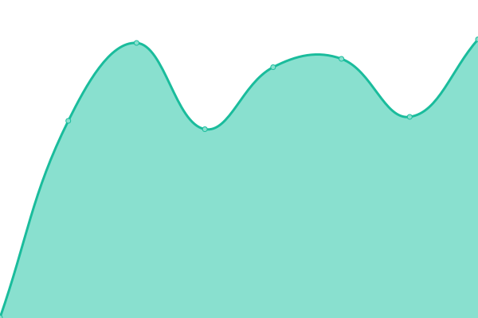

# [📈 Live Status](https://status.xn--sb-lka.org): <!--live status--> **🟩 All systems operational**

This repository contains the open-source uptime monitor and status page for [Nicolai Søborg](https://søb.org/), powered by [Upptime](https://github.com/upptime/upptime).

With [Upptime](https://upptime.js.org), you can get your own unlimited and free uptime monitor and status page, powered entirely by a GitHub repository. We use [Issues](https://github.com/NicolaiSoeborg/status.xn--sb-lka.org/issues) as incident reports, [Actions](https://github.com/NicolaiSoeborg/status.xn--sb-lka.org/actions) as uptime monitors, and [Pages](https://status.xn--sb-lka.org) for the status page.

<!--start: status pages-->
<!-- This summary is generated by Upptime (https://github.com/upptime/upptime) -->
<!-- Do not edit this manually, your changes will be overwritten -->
<!-- prettier-ignore -->
| URL | Status | History | Response Time | Uptime |
| --- | ------ | ------- | ------------- | ------ |
|  [Forside](https://xn--sb-lka.org/) | 🟩 Up | [forside.yml](https://github.com/NicolaiSoeborg/status.xn--sb-lka.org/commits/HEAD/history/forside.yml) | 

 900ms
     
 | 

<a href="https://status.xn--sb-lka.org/history/forside">100.00%</a>
    

|  [IP](https://ip.xn--sb-lka.org/) | 🟩 Up | [ip.yml](https://github.com/NicolaiSoeborg/status.xn--sb-lka.org/commits/HEAD/history/ip.yml) | 

 883ms
     
 | 

<a href="https://status.xn--sb-lka.org/history/ip">100.00%</a>
    

|  [IPv4](https://ipv4.xn--sb-lka.org/) | 🟩 Up | [i-pv4.yml](https://github.com/NicolaiSoeborg/status.xn--sb-lka.org/commits/HEAD/history/i-pv4.yml) | 

 893ms
     
 | 

<a href="https://status.xn--sb-lka.org/history/i-pv4">100.00%</a>
    

|  [Badger](https://badger.xn--sb-lka.org/) | 🟩 Up | [badger.yml](https://github.com/NicolaiSoeborg/status.xn--sb-lka.org/commits/HEAD/history/badger.yml) | 

 1768ms
     
 | 

<a href="https://status.xn--sb-lka.org/history/badger">100.00%</a>
    

|  [Matrix](https://matrix.søb.org/_matrix/federation/v1/version) | 🟩 Up | [matrix.yml](https://github.com/NicolaiSoeborg/status.xn--sb-lka.org/commits/HEAD/history/matrix.yml) | 

 860ms
     
 | 

<a href="https://status.xn--sb-lka.org/history/matrix">100.00%</a>
    

<!--end: status pages-->

[**Visit our status website →**](https://status.xn--sb-lka.org)

## 📄 License

- Powered by: [Upptime](https://github.com/upptime/upptime)
- Code: [MIT](./LICENSE) © [Anand Chowdhary](https://anandchowdhary.com), supported by [Pabio](https://pabio.com)
- Data in the `./history` directory: [Open Database License](https://opendatacommons.org/licenses/odbl/1-0/)
